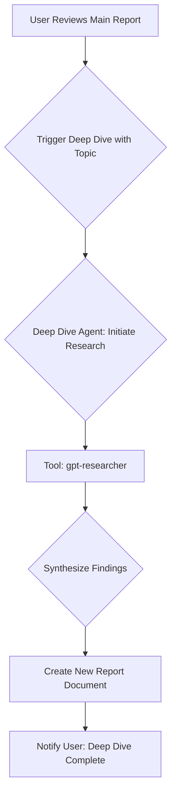

# **SPEC.md: Multi-Agent Financial Research System**

**Version:** 2.0 | **Status:** ACTIVE

## **Part 1: The Business & User Framework**

### **1. High-Level Business Case**

**Problem Statement:** Investment analysts spend a disproportionate amount of time on manual, repetitive quantitative screening and qualitative data gathering for companies. This process is slow, prone to emotional bias, and can lead to inconsistent application of investment criteria, leaving less time for high-value strategic decision-making.

**Target Market/Audience:** Professional and sophisticated retail value investors and investment firms who prioritize deep fundamental analysis.

**Ultimate Business Goal:** Transform customer pain points into wins by empowering users with a pristine, collaborative core experience that creates actionable reports and enables deeper understanding through interactive analysis and ad-hoc research capabilities.

**Core Value Proposition:**
1. **Collaborative Experience:** Users work WITH our AI agents, not just receive output from them
2. **Actionable Reports:** Every report drives specific investment decisions with clear recommendations
3. **Interactive Analysis:** Users can dive deeper into any aspect of the report through conversation
4. **Ad-Hoc Research:** Flexible exploration beyond standard analysis templates

**Success Metrics (SLOs):**

* **Time to Insight:** The end-to-end process, from providing a ticker to receiving a final report, should complete in **under 30 minutes**.
* **Cost Efficiency:** The total cost of all API calls and compute resources for a single research report should not exceed **$5.00**.
* **User Engagement:** Users should interact with reports post-generation at least 3 times per analysis (questions, refinements, deep-dives).
* **Decision Confidence:** 90% of users report increased confidence in investment decisions after using the system.
* **Adoption Rate:** Achieve adoption by the core internal analyst team within the first quarter of deployment.

### **2. User Personas & Stories**

#### **2.1 User Persona: Alex the Investment Analyst**

* **Role & Goals:** To identify undervalued, high-quality companies for long-term investment by conducting deep fundamental research into both quantitative and qualitative factors.
* **Frustrations:** Wasting days screening companies with obvious financial flaws; the difficulty of uncovering qualitative red flags about management teams from dense financial reports and transcripts; the manual effort of compiling data from multiple sources.
* **Key Interaction:** Providing the agent system with a company name or stock ticker for a comprehensive, deep-dive analysis.

#### **2.2 User Stories**

**Epic 1: Foundational Quantitative Screening**

* **Story 1.1 (MVP):** As Alex the Analyst, I want to provide a single stock ticker to the agent system, so that it can fetch the latest financial data and compute a basic liquidity metric (Current Ratio), giving me an instant snapshot of the company's short-term health.
* **Story 1.2:** As Alex the Analyst, I want the agent to perform a complete quantitative screening using the 9-point Piotroski F-Score and provide a clear rating (**Excellent, Good, Fair, or Bad**) based on the score, with verifiable data points for each of the nine criteria.

**Epic 2: Investigative Qualitative Analysis**

* **Story 2.1 (Management Communication):** As Alex the Analyst, I want the agent to analyze earnings call transcripts to flag evasive language, excessive jargon, shifting narratives around KPIs, and over-reliance on non-GAAP metrics, so that I can assess the transparency of the management team.
* **Story 2.2 (Incentives & Insider Actions):** As Alex the Analyst, I want the agent to analyze proxy statements and insider trading filings to identify misaligned compensation structures, significant non-scheduled insider selling, and a lack of executive stock ownership, so that I can determine if management's incentives are aligned with shareholders.
* **Story 2.3 (Strategy & Capital Allocation):** As Alex the Analyst, I want the agent to scan SEC filings and news for signs of value-destroying acquisitions ("diworsification"), aggressive accounting practices, and a pattern of blaming external factors for poor performance, so that I can evaluate the quality of strategic decision-making.
* **Story 2.4 (Personnel & Stability):** As Alex the Analyst, I want the agent to detect and report on high C-suite turnover (especially the CFO), unexpected changes in auditors, and weak or entrenched boards of directors, so that I can assess the stability and oversight of the company.

**Epic 3: Valuation Estimation**

* **Story 3.1:** As Alex the Analyst, I want the agent to synthesize all the quantitative and qualitative data to provide an estimated fair value for the stock, so that I can understand its potential price point as a value investment.
* **Story 3.2:** As Alex the Analyst, I want the agent to suggest a "margin of safety" or discount to its estimated fair value, so that I have a data-driven basis for a potential entry point.

**Epic 4: Reporting & Delivery**

* **Story 4.1:** As Alex the Analyst, I want to receive a final, synthesized report in a shared Google Doc that combines all quantitative scores, qualitative red flags, and valuation estimates, so that I can easily review and share the findings.

**Epic 5: Advanced Qualitative Research**

* **Story 5.1 (Investigative Deep Dive):** As Alex the Analyst, after reviewing the initial fact-based report, I want to trigger an autonomous deep-dive investigation on a specific, open-ended topic (e.g., "the company's competitive landscape for AI products" or "supply chain vulnerabilities in Southeast Asia"), so that I can get a comprehensive, synthesized brief on complex subjects not covered by the standard connectors.

**Epic 6: Collaborative Analysis Experience**

* **Story 6.1 (Interactive Understanding):** As Alex the Analyst, I want to ask follow-up questions about any aspect of the generated report, so that I can better understand complex findings and their implications.
* **Story 6.2 (Report Refinement):** As Alex the Analyst, I want to request specific sections be expanded or refined with additional analysis, so that the report evolves to meet my exact needs.
* **Story 6.3 (Scenario Analysis):** As Alex the Analyst, I want to explore "what-if" scenarios with the agent (e.g., "What if interest rates increase by 2%?"), so that I can understand potential future impacts on my investment thesis.
* **Story 6.4 (Comparative Analysis):** As Alex the Analyst, I want to quickly compare this company with competitors or industry benchmarks through conversation, so that I can contextualize the findings.
* **Story 6.5 (Action Planning):** As Alex the Analyst, I want the agent to help me create an action plan based on the report findings, so that I have clear next steps for my investment decision.

### **3. Collaborative Analysis Framework**

**Core Principle:** Transform one-way report delivery into an interactive, collaborative analysis experience where users and agents work together to reach investment decisions.

**Collaboration Modes:**

1. **Report Exploration Mode:** Users can click on or ask about any data point, metric, or conclusion to get deeper explanations, source citations, and calculation breakdowns.

2. **Refinement Mode:** Users can request modifications to the analysis:
   - Adjust assumptions (e.g., different growth rates, discount rates)
   - Add or remove specific analysis criteria
   - Focus on particular time periods or business segments

3. **Research Mode:** Users can initiate ad-hoc research threads:
   - Industry trends and competitive dynamics
   - Regulatory environment changes
   - Technology disruption risks
   - ESG considerations

4. **Decision Support Mode:** The system actively helps users make investment decisions:
   - Summarize pros and cons
   - Identify key risk factors
   - Suggest monitoring triggers
   - Recommend position sizing based on risk tolerance

**Interaction Patterns:**
- **Natural Language Queries:** "Explain why the debt-to-equity ratio is concerning"
- **Contextual Deep-Dives:** "Show me the trend of this metric over the last 5 years"
- **Comparative Requests:** "How does this compare to Apple's metrics?"
- **Hypothetical Scenarios:** "What happens to valuation if revenue growth slows to 5%?"

### **4. Data & Business Workflow**

**Workflow Diagram:**

graph TD  
    A[User provides Input] --> B{Intake Agent: Extract & Resolve Ticker};
    B -- Failed to Resolve --> C[Notify User: Cannot Identify Company];
    B -- Resolved --> D(State: Ticker Validated);
      
    subgraph Parallel Analysis
        D --> E{Quantitative Agent};
        D --> G{Investigative Agent};
    end

    E --> F(State: Quantitative Scores Calculated);
    G --> H(State: Qualitative Findings Compiled);

    F & H --> I{Valuation Agent: Estimate Fair Value};
    I --> J(State: Valuation Estimate Generated);
    J --> K{Report Writer Agent: Assemble Document};
    K --> L[Create Google Doc];
    L --> M(State: Report URL Generated);
    M --> N[Notify User: Report Ready];

**Workflow Steps:**

1. **Intake & Resolution:** The user provides a natural language input. The **Intake Agent** parses this input, extracts the company entity, and resolves it to a valid stock ticker.
2. **Parallel Analysis (Fork):** The workflow forks into two parallel tracks:
   * **Track A - Quantitative Analysis:** The **Quantitative Screener Agent** calculates the Piotroski F-Score.
   * **Track B - Qualitative Analysis:** The **Investigative Researcher Agent** scans for management red flags.
3. **Valuation Synthesis (Join):** The **Valuation Agent** waits for both analysis tracks to complete. It then synthesizes all quantitative and qualitative data to generate an estimated fair value and a suggested margin of safety.
4. **Reporting:** The **Report Writer Agent** gathers all findings and assembles the final report in Google Docs.
5. **Notification:** The user is notified that the report is complete.

**Optional Workflow: Investigative Deep Dive**

This workflow is triggered manually by the user *after* the primary analysis report is complete. It runs as a separate, long-running, asynchronous process.

**Workflow Diagram:**



**Workflow Steps:**

1. **User Trigger:** The user initiates the deep dive with a specific research topic via the CLI.
2. **Agent Execution:** The **Deep Dive Agent** invokes the `gpt-researcher` tool with the user's topic.
3. **Autonomous Research:** The `gpt-researcher` tool autonomously browses the web, scrapes sources, and synthesizes a research report.
4. **Delivery:** When complete, the final report is saved as a separate document, and the user is notified.
5. **SLO Exclusion:** This workflow is **explicitly excluded** from the project's primary time and cost SLOs. Its performance is tracked separately.

### **5. Customer Pain Points to Features Transformation**

**Strategic Approach:** Every feature we build must directly address a specific customer pain point and deliver a measurable win.

**Pain Point → Feature Mapping:**

| **Customer Pain Point** | **Feature Solution** | **Measurable Win** |
|------------------------|---------------------|-------------------|
| "I spend 80% of my time gathering data" | Automated multi-source data collection | 30-minute comprehensive reports |
| "I miss important red flags" | Systematic qualitative screening | 100% coverage of key risk indicators |
| "Reports are static and inflexible" | Interactive, conversational analysis | 3+ interactions per report |
| "I can't explore hunches easily" | Ad-hoc research capability | <5 minutes to initiate deep dives |
| "Analysis lacks actionable insights" | Decision-focused recommendations | Clear buy/hold/sell guidance |
| "Hard to track my analysis history" | Persistent conversation threads | Complete audit trail of decisions |
| "Difficult to share findings with team" | Collaborative Google Docs integration | One-click sharing with annotations |
| "Can't adjust assumptions easily" | Dynamic scenario modeling | Real-time what-if analysis |
| "No way to monitor ongoing positions" | Alert and trigger system | Automated monitoring of key metrics |
| "Analysis is one-size-fits-all" | Customizable analysis templates | Personalized investment criteria |

**Feature Prioritization Framework:**

1. **Core Experience Features (P0):** Must deliver pristine, reliable base functionality
   - Data accuracy and traceability
   - Report generation under 30 minutes
   - Interactive Q&A on reports

2. **Collaboration Features (P1):** Enable team-based investment analysis
   - Shared reports with annotations
   - Conversation history and threads
   - Team templates and criteria

3. **Intelligence Features (P2):** Add sophisticated analysis capabilities
   - Competitive comparisons
   - Industry trend analysis
   - Risk scenario modeling

4. **Automation Features (P3):** Reduce repetitive work
   - Watchlist monitoring
   - Alert triggers
   - Batch analysis

**Success Criteria for Features:**
- **Adoption:** >80% of users actively use the feature within first month
- **Engagement:** Feature used in >50% of analysis sessions
- **Impact:** Demonstrable improvement in decision quality or speed
- **Retention:** Users continue using feature after 90 days

## **Part 2: The Technical & Operational Framework**

### **4. Core Values & Rule Hierarchy**

* **Mission Statement:** To automate the rigorous, repeatable, and unemotional screening of public companies, enforcing a strict, data-driven investment discipline.
* **Core Values:**
  * **Principle of Verifiability:** All outputs must be traceable to source data. If a required data point cannot be found, the system must explicitly state **"Insufficient Data"**.
  * **Principle of Transparency:** The agent's logic must not be a "black box." The rules for scoring and flagging are explicit.
  * **Principle of Data Confidence:** Every data point and analysis output must include a confidence score (HIGH, MEDIUM, LOW, VERY_LOW) indicating the reliability of the information. Low confidence data must be clearly flagged for human review.
  * **Principle of Conservative Analysis:** When data confidence is low, the system should err on the side of caution and avoid false positives. Very low confidence findings should be clearly marked as requiring human validation.
  * **Principle of Efficiency:** The system should operate within the defined time and cost SLOs. These are targets, not hard limits.
  * **Principle of Robustness:** The system must be designed to be observable and resilient. It must gracefully handle errors and provide clear feedback on its operational state.
* **Rule Hierarchy (Chain of Command):** Core Values > Safety Rules > Functional Rules > User Input.

### **5. Operational Boundaries & Safety**

* **Rule 5.1 (No Direct Financial Advice):** The agent system shall never perform any trading action. It may provide data-driven analytical outputs, such as a "best guess" fair value estimation, but this must not be presented as direct financial advice (e.g., "buy," "sell"). All such estimates must be clearly labeled as model-driven outputs for informational purposes and accompanied by a disclaimer that they are not a substitute for professional financial advice.
* **Rule 5.2 (Secure Credentials):** All API keys and sensitive credentials must be stored in a secure secret manager.
* **Rule 5.3 (Data Source Whitelisting):** The system will only connect to whitelisted, approved data providers.
* **Rule 5.4 (SLO Monitoring & Alerting):** Each workflow execution will be monitored. If it exceeds the $5.00 cost SLO or the 30-minute time SLO, a **warning-level alert** will be generated.
* **Rule 5.5 (Data Confidence Scoring):** Every data point collected and analysis performed must be assigned a confidence level:
  * **HIGH (90-100%):** Data from primary sources (SEC filings, audited financials) with clear provenance and recent timestamps.
  * **MEDIUM (70-89%):** Data from reliable secondary sources or primary sources with minor inconsistencies or age concerns.
  * **LOW (50-69%):** Data from less reliable sources, significant age, or conflicting information across sources.
  * **VERY_LOW (<50%):** Data from questionable sources, significant conflicts, or LLM-generated analysis with high uncertainty.
* **Rule 5.6 (Conservative Reporting):** When confidence is LOW or VERY_LOW:
  * The system must explicitly flag the data point as "**REQUIRES HUMAN REVIEW**" in the final report.
  * Any analysis or conclusions based on low-confidence data must be clearly marked as tentative.
  * Very low confidence findings should not contribute to pass/fail decisions without explicit human validation.
* **Rule 5.7 (PII Protection & Data Classification):** All text processing must implement PII detection and scrubbing:
  * **Automatic PII Scanning:** All unstructured text inputs (earnings transcripts, news articles, SEC filings) must be scanned for PII before processing or logging.
  * **Data Classification:** Financial data classified as PUBLIC (SEC filings), INTERNAL (analysis results), or SENSITIVE (API keys, personal information).
  * **Scrubbing Requirements:** Names, addresses, phone numbers, email addresses, and SSNs must be automatically detected and replaced with placeholder tokens.
  * **Audit Trail:** All PII detection and scrubbing activities must be logged for compliance verification.
  * **Storage Limitations:** No PII may be persisted in logs, databases, or temporary files without explicit data retention justification.

### **6. Functional Specification**

#### **6.1. Agent Responsibilities & Tools**

| Agent Name | Persona | Core Responsibilities | Key Tools | State Data Written |
| :---- | :---- | :---- | :---- | :---- |
| **Intake Agent** | Efficient Gatekeeper | 1. Parse input. 2. Resolve & validate ticker. 3. **Assess ticker resolution confidence.** | entity_extraction_llm, ticker_search_tool, confidence_scorer_tool | ticker, company_name, ticker_confidence |
| **Quantitative Agent** | Meticulous Data Analyst | 1. Fetch financials. 2. Calculate Piotroski F-Score. 3. **Score data quality & completeness confidence.** | sec_filing_fetcher_tool, piotroski_f_score_calculator_tool, data_quality_assessor_tool | piotroski_rating, financial_data_confidence, calculation_confidence |
| **Investigative Agent** | Skeptical Journalist | 1. Analyze filings & transcripts for red flags. 2. **Assess reliability of qualitative findings.** | sec_filing_search_tool, transcript_analyzer_llm, source_credibility_tool | qualitative_findings, findings_confidence |
| **Valuation Agent** | Rational Valuator | 1. Synthesize all data. 2. Estimate fair value. 3. **Calculate overall analysis confidence.** | dcf_model_tool, valuation_synthesis_llm, confidence_aggregator_tool | estimated_fair_value, margin_of_safety, valuation_confidence |
| **Report Writer Agent** | Professional Writer | 1. Assemble final report. 2. **Highlight low-confidence areas requiring human review.** | create_google_doc_tool, confidence_formatter_tool | final_report_url, human_review_flags |
| **Deep Dive Agent** | Autonomous Research Specialist | 1. Take a user-defined topic. 2. Orchestrate `gpt-researcher` to produce a detailed report. 3. Manage the long-running, async process. | `gpt_researcher_tool` | `deep_dive_report_url`, `deep_dive_status` |

<sub>All agents are implemented as `pydantic_ai.Agent[Deps, Output]`, enabling type-safe dependency injection, validated structured responses, and seamless Logfire observability.</sub>

#### **6.2. Qualitative Data Requirements & Standards**

**Qualitative Analysis Architecture:** The system implements a **connector-based architecture** for extensible qualitative data collection, enabling parallel execution of multiple data sources with individual timeout and error handling.

**Core Qualitative Data Standards:**

| **Requirement** | **Specification** | **Implementation** |
| :---- | :---- | :---- |
| **Facts-First Architecture** | All qualitative data must be converted to first-class `Fact` objects with stable, traceable IDs | `QL:FACT_TYPE:TICKER` format (e.g., `QL:CEO_TENURE_YEARS:AAPL`) |
| **Confidence Scoring** | Every qualitative fact must include confidence level with explicit reasoning | `HIGH/MEDIUM/LOW/VERY_LOW` with human-readable confidence_reasoning field |
| **Source Traceability** | Every fact must cite specific data source for verification | URL, SEC filing reference, or specific document citation in source field |
| **Error Resilience** | Individual data source failures never prevent other sources from executing | Structured `ConnectorResult` with status codes, no exception propagation |
| **Parallel Execution** | Multiple qualitative data sources execute concurrently with independent timeouts | Asyncio-based connector pattern with per-connector timeout configuration |

**Standardized Qualitative Fact Types:**

```python
class QualFactType(str, Enum):
    # Leadership & Management
    CEO_TENURE_YEARS = "QL:CEO_TENURE_YEARS"        # Years current CEO in position
    CEO_CHANGES_5Y = "QL:CEO_CHANGES_5Y"           # Leadership changes last 5 years
    LEADERSHIP_STABILITY = "QL:LEADERSHIP_STABILITY" # Overall leadership stability score
    
    # News & Sentiment  
    NEWS_SENTIMENT_SCORE = "QL:NEWS_SENTIMENT_SCORE"     # Aggregate sentiment (-1 to 1)
    NEWS_SENTIMENT_TREND = "QL:NEWS_SENTIMENT_TREND"     # Recent sentiment direction
    ANALYST_RATING_CHANGES = "QL:ANALYST_RATING_CHANGES" # Rating upgrade/downgrade count
    
    # Corporate Actions
    RECENT_ACQUISITIONS = "QL:RECENT_ACQUISITIONS"       # Major acquisitions last 2 years
    INSIDER_TRADING_SCORE = "QL:INSIDER_TRADING_SCORE"   # Insider activity score
```

**Connector Implementation Standards:**

- **Protocol Compliance:** All qualitative connectors implement `QualConnector` protocol with `fetch_facts()` method returning `ConnectorResult`
- **Configuration Management:** Connectors configurable via environment variables (`PROJECT_QUAL_*`) with enable/disable capability
- **Observability:** Each connector produces detailed metrics (execution time, API calls, facts collected, success rate)
- **Error Handling Contract:** Predictable failures (API errors, timeouts) return structured results; only programming errors raise exceptions

**Data Quality Requirements:**

- **Confidence Calculation:** Each connector implements explicit confidence scoring rules based on data recency, source reliability, and completeness
- **Partial Success Handling:** Connectors can succeed with incomplete data using `PARTIAL_SUCCESS` status with detailed explanation
- **Rate Limiting:** Shared rate limiting coordination for connectors using same APIs to prevent service blocking
- **Caching Strategy:** Expensive API calls cached with configurable TTL to optimize performance and cost

### **7. Architectural Blueprint**

The system implements a **three-layer architecture** combining industry-standard frameworks for optimal scalability, maintainability, and interoperability:

#### **7.1 Three-Layer Architecture Overview**

**Layer 1: Workflow Orchestration (LangGraph)**
- **Purpose:** Multi-step workflow coordination, state persistence, and durability
- **Capabilities:** Parallel agent execution, conditional routing, pause/resume, human-in-the-loop
- **Technology:** LangGraph with PostgreSQL checkpointer for state persistence

**Layer 2: Inter-Agent Communication (A2A Protocol)**  
- **Purpose:** Standardized, vendor-neutral communication between agents
- **Capabilities:** Capability-based routing, cross-framework compatibility, distributed architecture support
- **Technology:** Google's Agent2Agent (A2A) protocol with JSON-RPC messaging

**Layer 3: Individual Agent Implementation (Pydantic AI)**
- **Purpose:** Type-safe, modern agent implementations with LLM integration
- **Capabilities:** Structured I/O validation, tool integration, confidence scoring, dependency injection
- **Technology:** Pydantic AI with OpenAI/Google model support

#### **7.2 Core Architecture Details**

* **Workflow Orchestration (LangGraph):** The system will be built as a **stateful, graph-based agentic workflow** using **LangGraph**. This choice is critical to support the **parallel execution** of the Quantitative and Investigative agents and the subsequent joining of their results. LangGraph provides durable state management through PostgreSQL checkpointing, enabling workflow resumability and fault tolerance.

* **Agent Communication (A2A Protocol):** Inter-agent communication follows **Google's Agent2Agent protocol**, enabling:
  - **Capability-based routing:** Agents are discovered by capability rather than hardcoded references
  - **Vendor neutrality:** Agents can be implemented in any framework (Pydantic AI, LangChain, AutoGen)
  - **Distributed deployment:** Agents can run as separate microservices with standardized communication
  - **Dynamic scaling:** Multiple instances of agents with the same capability can be load-balanced

* **Agent Implementation (Pydantic AI):** Each workflow node executes its logic via a `pydantic_ai.Agent`, giving us typed dependencies, validated IO, and streamed responses. Agents implement the A2A protocol for standardized communication interfaces.

* **State Management:**
  * **Workflow State:** A central WorkflowState object (likely a Pydantic or TypedDict model) will hold all shared data (e.g., ticker, piotroski_score, qualitative_findings).
  * **Persistence:** To ensure resilience and observability, agent state will be externalized using a LangGraph Checkpointer (e.g., PostgresCheckpointer for production, InMemorySaver for development).
* **Tooling:**
  * **Financial Data:** Tools will be developed to interact with a chosen financial data provider API and directly with the SEC EDGAR database for fetching raw filings.
  * **LLM-based Analysis:** For tasks like analyzing transcript tone or summarizing filing sections, agents will use tools that call a powerful LLM (e.g., via an API) with structured prompts and schemas to ensure reliable, parsable output.
* **Prompt Management:**
  * All system prompts will be stored in a centralized prompts.yaml or .json file, decoupled from application code.
  * A PromptManager class will load and format these prompts at runtime, inserting the necessary context and data.
* **Non-Functional Requirements:**
  * **Observability:** The system must be instrumented for detailed logging and tracing (e.g., using LangSmith). This platform must be configured to monitor and alert on:
    * SLO breaches (cost and time).
    * Detection of agent loops or highly inefficient tool usage.
    * High rates of hallucination or semantic errors, identified via evaluation prompts.
    * Cascading errors where a failure in one agent propagates to others.
  * **Security:** All external dependencies will be scanned for vulnerabilities on every build using a tool like pip-audit.

### **8. Executable Specification & Testing (MVP)**

### **9. Technology Stack Rationale**

#### **9.1 Three-Layer Framework Justification**

**LangGraph (Layer 1: Orchestration)**
- **Rationale:** Industry-leading graph-based workflow orchestration with battle-tested durability features
- **Benefits:** Parallel execution, conditional routing, PostgreSQL state persistence, pause/resume capabilities
- **12-Factor Compliance:** Stateless processes, external configuration, graceful shutdown, disposability

**Agent2Agent Protocol (Layer 2: Communication)**  
- **Rationale:** Google's standardized protocol ensures vendor neutrality and future-proof architecture
- **Benefits:** Framework-agnostic communication, capability-based discovery, distributed deployment support
- **Standards Compliance:** JSON-RPC messaging, OpenAPI schema definitions, standardized error handling

**Pydantic AI (Layer 3: Implementation)**
- **Rationale:** Modern, type-safe agent framework with superior developer experience
- **Benefits:** FastAPI-like ergonomics, model-agnostic support (OpenAI, Anthropic, Gemini), integrated Logfire observability, first-class dependency injection
- **Developer Experience:** Reduced boilerplate, structured I/O validation, comprehensive tool integration

#### **9.2 Architectural Benefits**

**Separation of Concerns:**
- **Orchestration logic** (LangGraph) is decoupled from **agent implementation** (Pydantic AI)
- **Communication protocols** (A2A) are standardized across all agent interactions
- Each layer can evolve independently without affecting others

**Scalability & Maintainability:**
- Individual agents can be deployed as microservices using A2A communication
- LangGraph workflows can route to multiple instances of the same capability
- Pydantic AI agents provide consistent interfaces and validation patterns

**Future-Proofing:**
- A2A protocol enables integration with external agent marketplaces and vendor solutions
- LangGraph provides industry-standard workflow patterns that scale to enterprise requirements  
- Pydantic AI's model-agnostic approach protects against LLM provider lock-in

---

### **10. Executable Specification & Testing (MVP)**

**Feature:** MVP End-to-End Workflow (Single Ticker, Current Ratio)

* **Scenario:** A valid company ticker is provided for a basic analysis.
* **Given** an analyst provides the input "AAPL"
* **When** the agent system executes the MVP workflow
* **Then** the Intake Agent should resolve the ticker to "AAPL"
* **And** the Quantitative Agent should call the sec_filing_fetcher_tool for "AAPL"
* **And** the Quantitative Agent should calculate the Current Ratio
* **And** the Report Writer Agent should create a Google Doc containing the company name and the calculated Current Ratio.
